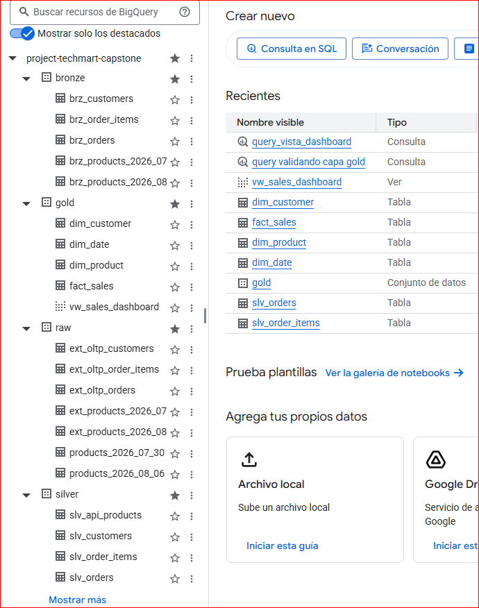
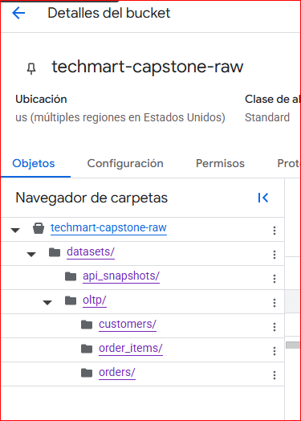
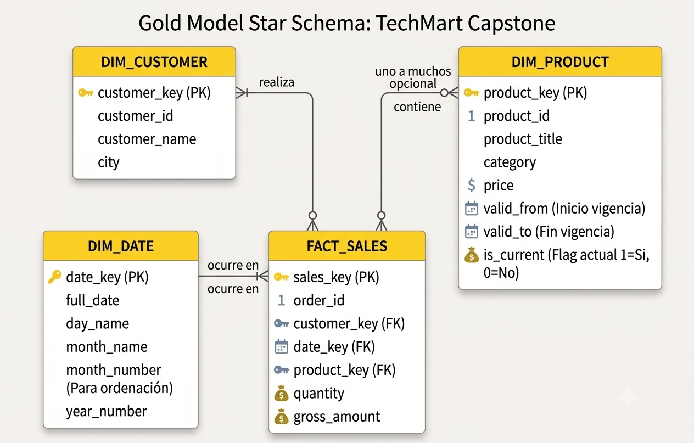
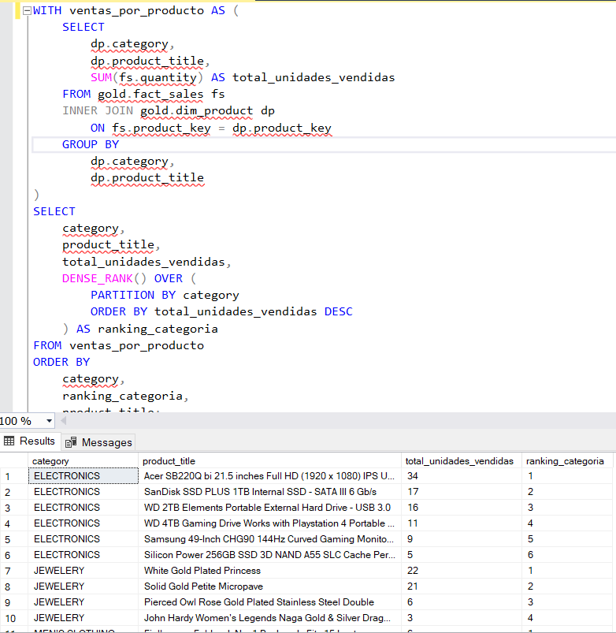
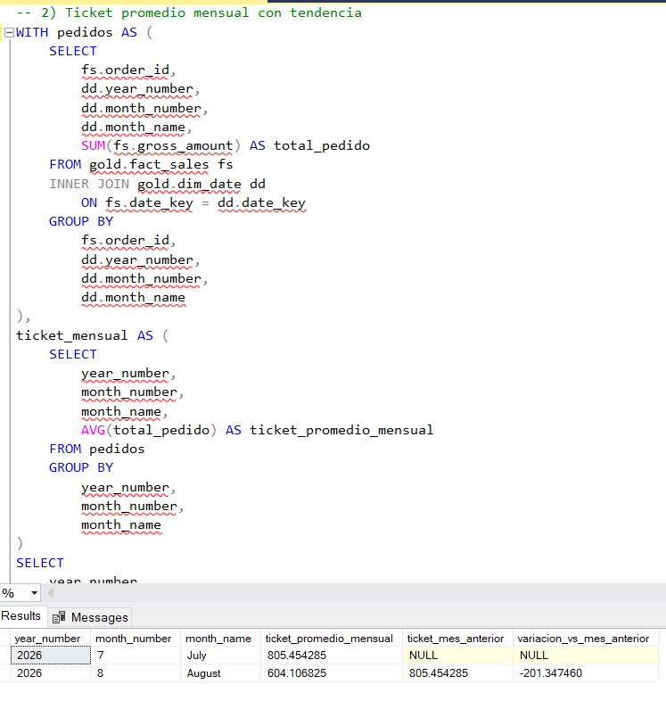
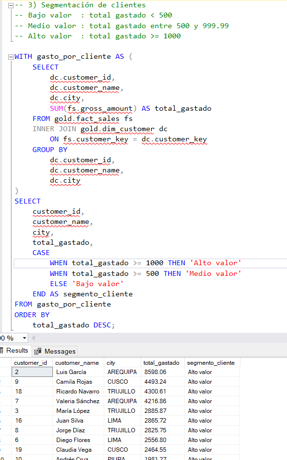
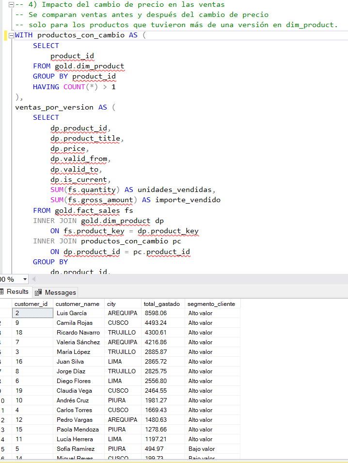
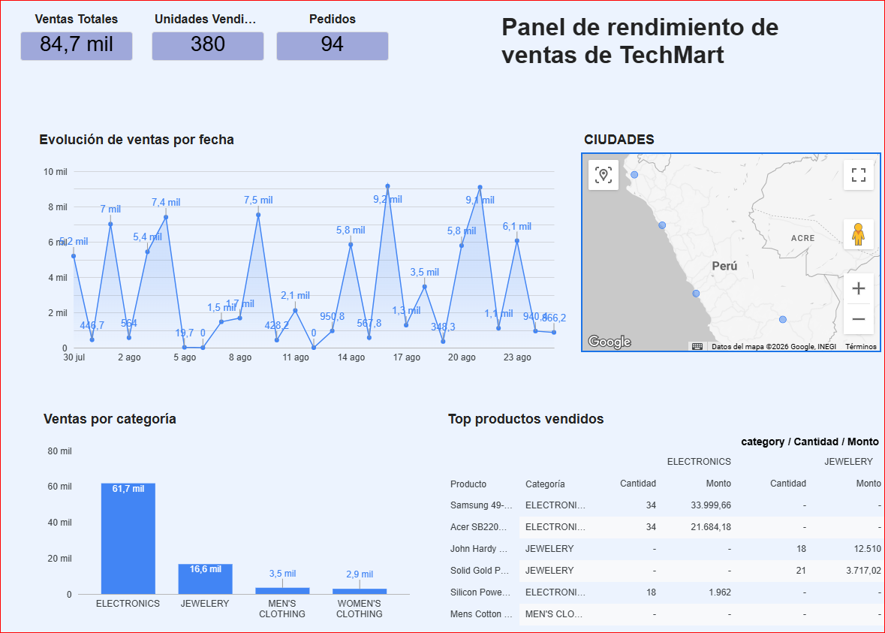
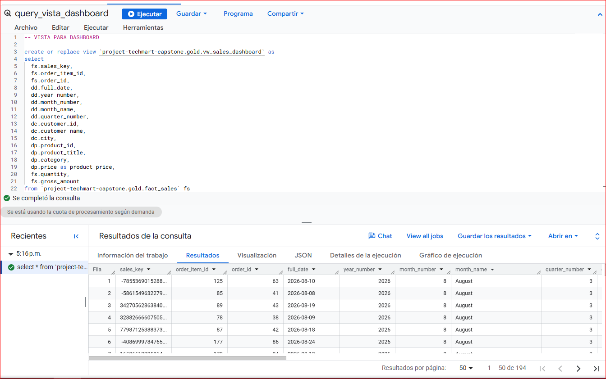
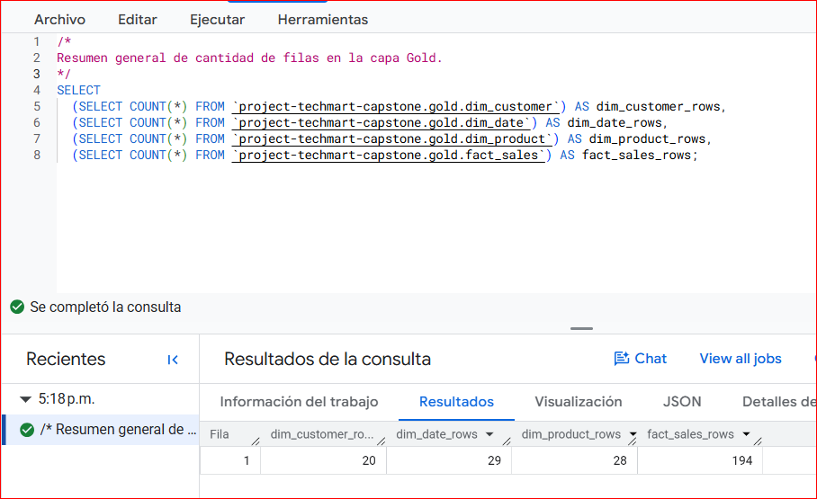

# Proyecto TechMart Capstone

Proyecto de Data Warehouse desarrollado en SQL Server bajo arquitectura **Bronze / Silver / Gold** y posteriormente migrado a Google Cloud Platform con BigQuery y Dataform. El repositorio integra una fuente externa de productos obtenida desde una API y datos transaccionales internos generados con Python para construir una capa analítica lista para negocio. [1][2]

## Objetivo

El objetivo del proyecto es construir un pipeline de datos por capas que permita extraer, limpiar, modelar y analizar información de ventas,y posteriormente adaptar esa misma solución a BigQuery y Dataform en Google Cloud Platform. Como resultado final, la solución entrega un modelo dimensional en Gold y consultas de negocio orientadas a análisis comercial. [1][2]

## Fuente de datos

Este proyecto trabaja con dos fuentes principales:

- **API de productos:** [Fake Store API](https://fakestoreapi.com/products), usada para obtener snapshots del catálogo de productos. [1]
- **Datos OLTP internos:** generados con Python mediante `scripts/extraction/generate_oltp.py` y almacenados como archivos CSV en `datasets/oltp/`. [3]

Además, para poder probar el historial de precios en `dim_product`, se utilizó un segundo snapshot simulado con cambios de precio a través del script `scripts/extraction/simular_dia2.py`. La guía explica que esta simulación es necesaria porque la Fake Store API no cambia precios de forma natural entre extracciones. [1]

## Tecnologías usadas

- SQL Server para la implementación inicial del Data Warehouse. [1]
- Google BigQuery como motor analítico en la versión migrada a GCP.
- Dataform para definir y ejecutar transformaciones mediante archivos `.sqlx` y lógica reutilizable en `includes/macros.js`.
- Python para extracción, generación de datos OLTP y simulación de snapshots.
- Looker Studio / Power BI para visualización y consumo analítico final.
- 
## Arquitectura

El proyecto sigue la arquitectura Medallion, separando responsabilidades en tres capas: [1][2]

- **Bronze:** carga cruda de archivos JSON y CSV, sin transformación de negocio. [1]
- **Silver:** limpieza, estandarización, deduplicación y preparación de datos para consumo analítico. [1]
- **Gold:** modelo dimensional orientado a negocio con tablas de dimensiones y hechos. [1][2]

Esta separación permite mantener trazabilidad, calidad de datos y una evolución ordenada del pipeline desde la extracción hasta la analítica final. [1]

## Estructura del proyecto SQL SERVER

```text
proyecto-techmart-capstone/
├── README.md
├── datasets/
│   ├── api_snapshots/
│   │   ├── products_2026-07-30.json
│   │   └── products_2026-08-06.json
│   └── oltp/
│       ├── customers.csv
│       ├── orders.csv
│       └── order_items.csv
├── scripts/
│   ├── extraction/
│   │   ├── extract_dia1.py
│   │   ├── generate_oltp.py
│   │   └── simular_dia2.py
│   ├── bronze/
│   │   ├── ddl_bronze.sql
│   │   └── proc_load_bronze.sql
│   ├── silver/
│   │   ├── ddl_silver.sql
│   │   └── proc_load_silver.sql
│   ├── gold/
│   │   ├── ddl_gold.sql
│   │   ├── proc_load_gold.sql
│   │   └── fase4_analitica_negocio.sql
│   └── init_database.sql
├── tests/
│   ├── quality_checks_silver.sql
│   └── quality_checks_gold.sql
└── docs/
    └── (capturas o diagramas)
```

### Estructura en GCP con Dataform
```text
definitions/
├── assertions/
├── bronze/
│   ├── brz_customers.sqlx
│   ├── brz_order_items.sqlx
│   ├── brz_orders.sqlx
│   ├── brz_products_2026_07_30.sqlx
│   └── brz_products_2026_08_06.sqlx
├── gold/
│   ├── dim_customer.sqlx
│   ├── dim_date.sqlx
│   ├── dim_product.sqlx
│   └── fact_sales.sqlx
├── silver/
│   ├── slv_api_products.sqlx
│   ├── slv_customers.sqlx
│   ├── slv_order_items.sqlx
│   └── slv_orders.sqlx
└── sources/
    ├── src_oltp_customers.sqlx
    ├── src_oltp_order_items.sqlx
    ├── src_oltp_orders.sqlx
    ├── src_products_2026_07_30_raw.sqlx
    └── src_products_2026_08_06_raw.sqlx
includes/
└── macros.js
workflow_settings.yaml
```
### Estructura BigQuery



### Estructura Buckets GCP



## Proceso de desarrollo

### Fase 0: extracción y simulación

Primero se obtuvo un snapshot real de productos desde la API mediante `extract_dia1.py`. Luego se generó un segundo snapshot con cambios simulados de precio usando `simular_dia2.py`, con el fin de probar el comportamiento SCD Type 2 en la dimensión de productos. [1]

### Fase 1: Bronze

En Bronze se cargaron los datos tal como llegaron desde la API y los archivos OLTP. Esta capa conserva la estructura original de la fuente y actúa como zona cruda del pipeline. [1]

### Fase 2: Silver

En Silver se aplicaron procesos de limpieza, estandarización y preparación para consumo analítico. La idea principal de esta capa es dejar los datos consistentes antes de modelarlos en Gold. [1]

### Fase 3: Gold

En Gold se construyó el modelo dimensional del proyecto. Esta capa incluye dimensiones, tabla de hechos y una implementación de `dim_product` con SCD Type 2 para conservar el historial de cambios de precio por rango de vigencia. [1][2]

### Fase 4: analítica de negocio

Finalmente, se desarrollaron cuatro consultas de negocio que aplican funciones analíticas y explotan el modelo Gold para responder preguntas comerciales. [1][2]

### Fase 5: migración a GCP con BigQuery y Dataform

Una vez completada la implementación en SQL Server, el proyecto fue migrado a Google Cloud Platform para replicar la arquitectura Bronze / Silver / Gold en BigQuery. En esta versión, las transformaciones fueron modeladas en Dataform mediante archivos `.sqlx`, reutilizando lógica común desde `includes/macros.js` y manteniendo la implementación SCD Type 2 en `dim_product`.

## Modelo dimensional

La capa Gold está compuesta por los siguientes objetos principales: [1][2]

- `dim_customer`
- `dim_date`
- `dim_product` (SCD Type 2)
- `fact_sales`

`dim_product` conserva historial de precio mediante los campos `valid_from`, `valid_to` e `is_current`, permitiendo identificar qué versión del producto estaba vigente en el momento de cada venta. [1][2]

## Star schema
El siguiente diagrama muestra la relación entre las tablas de dimensiones y la tabla de hechos en la capa Gold.




## Quality checks

El proyecto incluye validaciones de calidad separadas por capa: [4][1]

- `quality_checks_silver.sql`: revisa consistencia y calidad de los datos limpios en Silver. [1]
- `quality_checks_gold.sql`: valida la integridad analítica en Gold, incluyendo historial real en `dim_product`, vigencia de versiones y consistencia de la fact table con sus dimensiones. [1]

Estas verificaciones ayudan a confirmar que el pipeline carga correctamente y que los resultados de negocio se apoyan en un modelo confiable. [1]

## Analítica de negocio

La Fase 4 responde las siguientes preguntas: [5][6][1]

1. **Ranking de productos más vendidos por categoría**, usando `DENSE_RANK()` para reiniciar el ranking dentro de cada categoría. [5][6]
2. **Ticket promedio mensual con tendencia**, usando `AVG() OVER()` y `LAG()` para comparar cada mes con el anterior. [5][6]
3. **Segmentación de clientes**, usando `CTE + CASE` para clasificar clientes según su gasto acumulado. [5][6]
4. **Impacto del cambio de precio en las ventas**, usando el historial de `dim_product` para comparar comportamiento antes y después del cambio. [5][6][2]

## Resultados

Aquí se muestran las capturas de los resultados obtenidos en SQL Server para las consultas de la Fase Analítica.


### Ranking por categoría


### Ticket promedio mensual


### Segmentación de clientes


### Impacto del cambio de precio


## Dashboard y consumo analítico

Sobre la capa Gold en BigQuery se construyó un dashboard para consumo analítico en Looker Studio / Power BI. Esta visualización permite explotar las métricas del modelo dimensional y validar el uso de `fact_sales` junto con las dimensiones, incluyendo el historial SCD2 de `dim_product`.

### Vista general del dashboard


### Vista de tabla dashboard general


### Resumen de Capa Gold


### Dim Product
```text
config {
  type: "table",
  schema: "gold",
  name: "dim_product",
  tags: ["gold"]
}

js {
  const { clean_string, surrogate_key } = require("includes/macros");
}

with base_products as (
  select
    cast(product_id as int64) as product_id,
    ${clean_string("title")} as product_title,
    upper(${clean_string("category")}) as category,
    cast(price as numeric) as price,
    coalesce(cast(rating_rate as numeric), 0) as rating_rate,
    coalesce(cast(rating_count as int64), 0) as rating_count,
    cast(extraction_date as date) as extraction_date
  from ${ref("slv_api_products")}
),

ordered_products as (
  select
    *,
    lag(price) over (
      partition by product_id
      order by extraction_date
    ) as previous_price
  from base_products
),

change_points as (
  select
    *,
    case
      when previous_price is null then 1
      when price != previous_price then 1
      else 0
    end as is_new_version
  from ordered_products
),

versioned_products as (
  select
    *,
    sum(is_new_version) over (
      partition by product_id
      order by extraction_date
      rows between unbounded preceding and current row
    ) as version_number
  from change_points
),

scd2_base as (
  select
    product_id,
    version_number,
    any_value(product_title) as product_title,
    any_value(category) as category,
    any_value(price) as price,
    any_value(rating_rate) as rating_rate,
    any_value(rating_count) as rating_count,
    min(extraction_date) as valid_from
  from versioned_products
  group by
    product_id,
    version_number
),

scd2_final as (
  select
    ${surrogate_key(["product_id", "valid_from"])} as product_key,
    product_id,
    product_title,
    category,
    price,
    rating_rate,
    rating_count,
    valid_from,
    coalesce(
      lead(valid_from) over (
        partition by product_id
        order by valid_from
      ),
      date '9999-12-31'
    ) as valid_to,
    case
      when lead(valid_from) over (
        partition by product_id
        order by valid_from
      ) is null then true
      else false
    end as is_current
  from scd2_base
)

select *
from scd2_final
```
## Supuestos de limpieza y modelado

- Se conservaron dos snapshots de productos para poder detectar cambios reales de precio entre extracciones. [1]
- Los cambios de precio en `dim_product` se identifican comparando cada precio con su valor anterior mediante funciones de ventana. [1][2]
- La dimensión de productos se modeló como SCD Type 2 para mantener el historial completo de versiones. [1][2]
- La tabla `fact_sales` debe relacionarse con la versión histórica correcta del producto según la fecha de la venta. [1][2]
- La segmentación de clientes se define en función del total gastado acumulado por cliente.

## Ejecución del proyecto

### Versión SQL Server
Para ejecutar el proyecto desde cero:

1. Ejecutar `scripts/init_database.sql` para crear la base y los esquemas.
2. Ejecutar la extracción y generación de datos en `scripts/extraction/`.
3. Cargar la capa Bronze con `proc_load_bronze.sql`. [1]
4. Cargar la capa Silver con `proc_load_silver.sql`. [1]
5. Crear y cargar Gold con `ddl_gold.sql` y `proc_load_gold.sql`.
6. Ejecutar `tests/quality_checks_silver.sql` y `tests/quality_checks_gold.sql`. [1]
7. Ejecutar `scripts/gold/fase4_analitica_negocio.sql` para consultar los resultados finales.

### Versión GCP
1. Cargar los archivos fuente en GCS.
2. Crear las tablas externas y datasets en BigQuery.
3. Abrir el repositorio en Dataform.
4. Ejecutar primero `bronze`, luego `silver` y luego `gold`.
5. Revisar los resultados en BigQuery y el dashboard en Looker Studio / Power BI.

## Estado de entrega

El proyecto incluye la entrega principal solicitada: [4][1]

- arquitectura Bronze / Silver / Gold,
- historial real en `dim_product`,
- quality checks en Silver y Gold,
- consultas de negocio de la Fase 4 resueltas,
- estructura de proyecto organizada para revisión.
- migración a Google Cloud Platform con BigQuery y Dataform.
- estructura Dataform con archivos `.sqlx` e `includes/macros.js`.
- historial real en `dim_product` con SCD Type 2.
- quality checks en Silver y Gold.
- consultas de negocio resueltas.
- dashboard final en Looker Studio / Power BI.


## Autor

Proyecto realizado por: **Renzo Luza**
GitHub: [rluzav](https://github.com/rluzav)  
